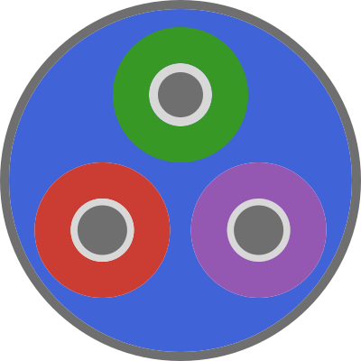

# LineCableModels.jl



[](https://electa-git.github.io/LineCableModels.jl/dev/)
[](https://github.com/Electa-Git/LineCableModels.jl/actions/workflows/CI.yml?query=branch%3Amain)
[](LICENSE)
[](https://codecov.io/gh/Electa-Git/LineCableModels.jl)

LineCableModels.jl computes electrical parameters for underground and overhead
power cables and supports uncertainty propagation through cable geometry and
material data.

## Features

- Solid, tubular, stranded, screened, and armored cable models.
- Frequency-dependent series impedance and shunt admittance calculations.
- Earth-return calculations, modal transformations, and ATPDraw/PSCAD data
  exchange.
- Material and cable libraries with JSON import and export.
- One typed `Grid`/`Gridspace` grammar for deterministic and uncertain designs.
- Ordinary, combinatorial, and conditional Monte Carlo execution through
  `compute`.
- Optional Makie plotting through Julia package extensions.

## Installation

After version 0.2.0 is accepted into the Julia General registry:

```julia-repl
pkg> add LineCableModels
```

Until registration is complete, install the release commit from GitHub:

```julia-repl
pkg> add https://github.com/Electa-Git/LineCableModels.jl
```

Core usage has no plotting dependency:

```julia
using LineCableModels
```

The default modelling API is declarative:

```julia
copper = Material(; rho=1.7241e-8)
xlpe = Material(; rho=1.97e14, eps_r=2.5)

design = CableBuilder(
    "example",
    Conductor.Solid(:core; radius=10e-3, material=copper),
    Insulator.Tubular(:core; thickness=8e-3, material=xlpe),
    Conductor.Tubular(:screen; thickness=1e-3, material=copper),
    Insulator.Tubular(:screen; thickness=2e-3, material=xlpe),
)

constants = compute(CableConstantsProblem(design), Formulation())
```

`Material` is the materialised type as well as the public declarative
constructor: scalar keywords return one material, while explicit `Grid` inputs
return a `Gridspace{Material}`. The stricter cable and system constructors
remain available from explicit submodules such as `LineCableModels.DataModel`
and `LineCableModels.EarthProps`.

## Optional plotting

Load one Makie backend explicitly before calling `preview`, `plot`, or
`set_backend!`:

```julia
using LineCableModels
using CairoMakie

set_backend!(:cairo)

plots = plot(line_parameters) # Vector{UIPlot}, one page per quantity
export_svg(first(plots); path = "series_resistance.svg")
```

`GLMakie` and `WGLMakie` are supported in the same way. LineCableModels
never imports or selects a backend dynamically. `preview` returns one `UIPlot`.
line-parameter plots always return a
`Vector{UIPlot}`. The Export SVG control preserves the current declarative plot
state and requires CairoMakie to have been loaded explicitly.

## Result access

`CableConstants` stores R/L/C values per metre. `LineParameters`
stores its frequency domain and either a `:pul` or `:total` basis:

```julia
basis(line_parameters)
line_parameters.Z[1, 1, :]      # direct array access
@view line_parameters.Y[1, 1, :]
R(line_parameters, 1, 1)       # complete frequency response
Z(line_parameters, 1, 1, 2:5) # selected frequency samples
@observe line_parameters Z[1, 2, :]
abs.(Z(line_parameters, 1, 1))

label(R)                         # "Series resistance"
symbol(Z, angle)                 # "∠Z"
label(display_unit(R, :pul))     # "Ω/km"
```

Complete parameter traversals return `ParametricResult{T}`, including a space
with cardinality one. Conditional Monte Carlo propagation returns
`MonteCarloResult{T}`. Use `statistics`, `samples`, `histograms`, and
`uncertain_value` to inspect stored calculation data. Result order is
the Gridspace iteration order. Traversal state is not copied into completed
results. Parametric, linear-error, and Monte Carlo results are ordinary finite
collections: indexing and iteration return stored core results, and Base
`first`, `last`, `only`, `collect`, `map`, and `zip` retain their standard
meanings.
`DataFrame(monte_carlo_result)` renders marginal summaries, while
`plot(monte_carlo_result, R; mode=:hist, data=:both)` and the `:pdf`, `:ecdf`,
and `:qq` modes display retained distribution information after a Makie package
is loaded.

Higher-order calculations keep supplemental computation output separate from
their scientific products. `details(result)` returns the empty named tuple by
default. Construct `Combinatorial`, `LinearError`, or `MonteCarlo` with
`options=(retain_details=true,)` only when the core computation owner has
registered a `computation_details` method and those records are needed.

Physics and numerical-method choices belong to `Formulation`. Execution choices
are passed as a named tuple. For a materialised line system, pass
`options=(output_basis=:total,)` to `compute` to scale both Z and Y by the line
length. Composite calculations select their operation explicitly, for example
`compute(ParametricProblem(space), Combinatorial(Formulation()))`.

Human-facing XLSX output is a ReportBuilder operation:

```julia
using XLSX

artifact = report(XLSXReport(file_name="line_parameters.xlsx"), line_parameters)
artifact.output
```

XLSX is an optional dependency; loading it activates the workbook writer. The
established `export_data(:xlsx, line_parameters; ...)` call delegates to the
same report and returns its output path.

## Retired FEM and sector support

FEM/GetDP support and sector-shaped cable support were removed before the
v0.2 release. Their final snapshot is branch `legacy/fem-sector` at commit
`b75dd2723f90a83ec090b20605ea42af57f4a9c3`. To use that historical version in
the current Julia project:

```sh
julia --project=. -e "using Pkg; Pkg.add(Pkg.PackageSpec(url=ARGS[1], rev=ARGS[2]))" https://github.com/Electa-Git/LineCableModels.jl.git b75dd2723f90a83ec090b20605ea42af57f4a9c3
```

See the [documentation](https://electa-git.github.io/LineCableModels.jl/) and
[examples](examples) for supported workflows.

## License and citation

LineCableModels.jl is distributed under the [BSD 3-Clause License](LICENSE).
Citation metadata is provided in [CITATION.cff](CITATION.cff).

## Acknowledgements

This work is supported by the Etch Competence Hub of EnergyVille, financed by
the Flemish Government. The primary developer is Amauri Martins
([@amaurigmartins](https://github.com/amaurigmartins)).

<p align="left">
  <br>
  <br>
  <br>
</p>
