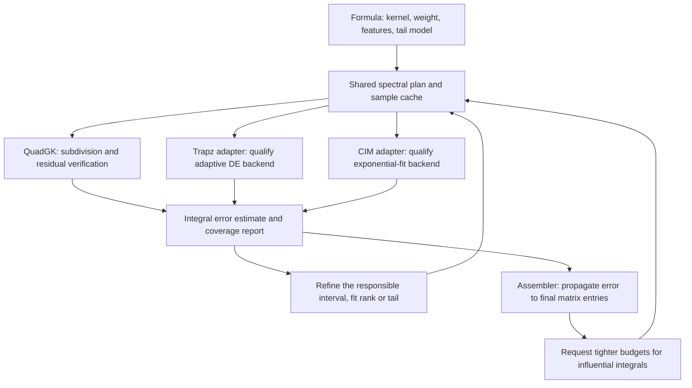

# Shared adaptive spectral sampling

This is the numerical architecture required by the user's refinement of the
[locked earth-return plan](unified-earth-return-implementation-plan.md). It
applies to spectral integration generally, including retained author formulas.
The accepted earth/FEM comparisons stand. Shared coverage and error control are
implementation requirements; the shared adapters are now implemented and under
validation. The package review below narrows the implementation strategy:
reuse numerical backends before implementing additional general-purpose machinery.

## Package reuse decision, 2026-09-09

The earlier design prescribed too much custom numerical infrastructure. Lock
the assurance contract and the separation of responsibilities, but qualify
existing packages before choosing a new trapezoidal or exponential-fit engine.
The original package review below is retained as the decision trail. Subsequent
execution qualified DE 0.1.0 with an adapter and rejected ExpFit. See the
[qualification record](spectral-package-qualification.md) for type/uncertainty
findings and remaining implementation gates.

| Package | Reusable capability | Decision and remaining gap |
|---|---|---|
| [QuadGK.jl](https://juliamath.github.io/QuadGK.jl/stable/api/) — already a dependency | Adaptive subdivision, local error estimates, explicit breakpoints, complex piecewise-linear contours, infinite intervals, reusable segment buffers/partitions, and vector integrands with a custom norm. | Reuse its public APIs for quad and weighted residual verification; evaluate partition reuse for other adapters. A Gauss–Kronrod partition does not certify trapezoids or an exponential fit. |
| [DoubleExponentialFormulas.jl](https://machakann.github.io/DoubleExponentialFormulas.jl/stable/) | Adaptive transformed trapezoids, finite and infinite intervals, user breakpoints, and reusable typed node/weight tables. | First candidate for the trapz numerical backend. Its successive-level error estimate still needs feature-aware subdivision and physical tail checks; the docs explicitly recommend subdivision for fine structure. Qualify complex-valued kernels, types, oscillations and costs before adoption. |
| [ExpFit.jl](https://github.com/DOC-Package/ExpFit.jl) | Complex exponential sums from sampled data/functions; the source contains matrix-pencil, ESPRIT and related fitting routines. | Candidate for the bounded fitting task inside CIM. The documented function API takes a finite interval and sample count; the sampled-data API takes equally spaced values. It does not supply our adaptive spectral coverage, image transforms or final integral error contract. |
| [RationalFunctionApproximation.jl](https://complexvariables.github.io/RationalFunctionApproximation.jl/stable/algorithms) | Continuum AAA with adaptive sampling on real/complex domains, automatic rational approximation and error diagnostics. | Useful alternative to investigate if a surrogate is needed, but do not add it as a separate required sampling layer initially. Rational functions are not the exponential images used by our existing analytic transforms. Its diagnostics are estimated errors, not universal coverage guarantees. |

[Integrals.jl](https://docs.sciml.ai/Integrals/stable/) supplies a common interface
to integration backends. The existing integration-selection API already serves
that role here; adding another wrapper does not resolve the sampling issue.

ExpFit's inspected [Project.toml](https://github.com/DOC-Package/ExpFit.jl/blob/main/Project.toml)
declares `1.0.0-DEV` and dependencies including FFTW, AMRVW and
RationalFunctionApproximation with compat `0.1.4`. Treat it as a candidate whose
API, dependency compatibility, allocation behavior and maintenance suitability
must be checked, not as an already qualified replacement. No claim of benchmarked
speed or scalar-type compatibility is made for either new candidate.

The implementation owns a small spectral adapter: mathematical feature/contour
and tail metadata, method-specific sample requirements, weighted error budgets,
typed workspace coordination, and propagation to Ze/Pe/Ye. Let qualified
packages own their numerical refinement and fitting internals. Do not build a
second general-purpose interval heap, quadrature engine, rational approximator
or pencil solver by default. Keep existing local primitives until replacement
is justified; custom additions require a demonstrated gap on our cases.

Qualification compares candidate adapters with the existing methods on the
frozen two/three-wire matrices, the small 1 MHz Ye13 entry, declared branch and
narrow-feature cases, oscillatory/tail cases, required scalar types and warmed
evaluation/allocation costs. Record exact package versions. A package error
estimate remains one input to the full acceptance test. Preserve public method
and option meanings; if adopting DE for trapz, document the transformed-rule
change and map existing work limits explicitly. Package choice is resolved in
this implementation milestone without reopening the accepted physical benchmark.

## Original algorithm gaps motivating the shared adapter

`src/engine/integration.jl` already separates a residual kernel from an analytic
weight through `SpectralIntegral`. Keep that boundary and extend it.

| Current behavior | Gap to close |
|---|---|
| Trapz maps the whole truncated interval through logarithmic and sine coordinates, doubles its grid and compares signed totals. | Local errors can cancel or a feature can be missed by both grids. Extending the cutoff changes all mapped nodes and repeats work. |
| Trapz compares successive truncated totals. | A small shell integral does not bound the remaining tail. |
| CIM multiplies the cutoff by four until one weighted endpoint is small. | A zero or a later peak can produce a false cutoff; the sample amplitude is not an integral tail bound. |
| CIM generates pencils on predetermined scale-based windows. | All windows/refinements receive work regardless of where the residual is unresolved. The initial smallest spacing can miss a smaller material scale. |
| CIM uses global rtol to choose its SVD cutoff and permits a held-out point residual proportional to sqrt(rtol). | Tightening integral atol does not directly tighten rank selection or the integrated fit error. |
| CIM integrates the fitted images to infinity after testing samples on a finite interval. | The fitted continuation beyond that interval also needs its own tail check. |
| CIM compares with independent quad. | Both can miss a feature when neither is told that it exists. |

The diagnostic `test/gauntlet/spectral_sampling_audit.jl` evaluates

```math
I=\int_0^\infty \exp[-(\lambda-9)^2/(2\times10^{-8})]e^{-\lambda}\,d\lambda.
```

Its exact value is `3.0934250583705595e-8`. At `rtol=1e-6, atol=1e-12`, the
current quad, trapz and CIM all return zero. The nearest trapz sample is over
201 feature widths from the centre. Quad with explicit feature breakpoints
returns `3.0934250583735546e-8`. This is a synthetic coverage diagnostic, not a
claim that the earth kernel contains that Gaussian. It demonstrates why no
finite sampler can guarantee accuracy for an unrestricted black-box function.

For the actual 1 MHz earth case, `|κg|=8.88577 m⁻¹`, while the air branch point
is at `λ=0.02095845 m⁻¹`. With 128 samples the initial smallest pencil spacing
is `0.06996666 m⁻¹`; the first positive amplitude and validation log-grid nodes
are approximately `0.06942` and `0.06888 m⁻¹`. This is a concrete coverage risk,
not proof that it is the sole cause of the observed CIM discrepancy.

## One shared contract, distinct numerical backends

The Engine coordinates spectral coverage, local error budgets, tail extension,
workspace reuse and termination through backend adapters. Formula owners supply
the mathematical structure of their kernels. Numerical packages perform the
refinement/fitting that they support and return diagnostics. The earth assembler
separately propagates those errors to Ze/Pe/Ye; the spectral adapter does not
know about conductor counts or authors. Sharing a contract does not require all
methods to share a node sequence or one custom refinement engine.



Use private, concrete structures as needed, conceptually `SpectralFeatures`,
`SpectralPlan`, `SpectralWorkspace` and `SpectralEstimate`. These names do not
introduce a second public formula-selection system. Keep the existing
`SpectralIntegral` constructor usable, and retain
`integration=(method=:quad|:trapz|:cim, options=(...))`.

- **Descriptor:** typed feature, contour and tail callbacks, plus analytic-weight
  evaluation/transform capabilities. Features are physical metadata, not user
  grid-tuning parameters. Existing descriptors without this metadata retain an
  explicitly estimated-accuracy path; they cannot claim a certified bound.
- **Plan:** mandatory feature coverage, contour/branch identity, local budgets
  and fit-window status, with bounded backend-owned partitions where available.
  Track nested sample indices only where the method adapter needs them. Initial
  samples seed refinement; they never establish convergence.
- **Workspace:** concrete buffers for cached kernel/material evaluations, panel
  estimates, image candidates and linear algebra. Integrators reuse those
  buffers and evaluations rather than allocating separate global grids.
- **Estimate:** value, discretization/fit error, true-kernel tail error, fitted
  tail error where applicable, roundoff estimate, evaluation count and status.
  Distinguish estimated error from a bound supported by analytic envelopes.
  The public value-returning `integrate` wrapper preserves explicit failure on
  nonconvergence; the system assembler consumes the richer internal result.

Implement the small shared adapter in an Engine-owned `spectralsampling.jl`, with the
method adapters in `integration.jl`. Keep earth-specific feature construction
in `earthkernels.jl`, and final matrix error propagation in `earthreturn.jl`.
Wire concrete reusable resources through the existing preflight/workspace path.

## Coverage and refinement policy

1. **Establish the mathematical domain first.** Declare branch points/cuts,
   extracted poles and residues, known local transitions, admissible contours
   and the region where the tail model is valid. For earth kernels, include
   both medium roots `±sqrt(-κm²)` and relevant denominator zeros/near-zeros,
   not just the largest `|κm|`. Unknown near-singular denominators require
   resolution before claiming coverage. Generic callbacks must supply their
   own feature/regularity information for stronger guarantees.
2. **Seed intervals around every scale.** Include the origin, feature locations
   projected onto the contour and their widths/distances from it, plus decay
   and phase scales from the actual weight. Cover all declared features before
   accepting a cutoff. Geometrically spaced intervals bridge widely separated
   scales; the scale parameter nondimensionalizes work, not the physics.
3. **Apply method-appropriate resolution floors.** Trapz must resolve the sampled
   kernel, Jacobian and weight, including cosine and J0 oscillations. Bound the
   phase change per cell initially by a conservative fraction of π, then check
   local convergence. CIM pencils resolve the residual being fitted; analytically
   integrated cosine oscillations need not force redundant pencil samples.
   Its weighted residual verifier must resolve those weights/envelopes.
4. **Probe outside the training grid.** Use nested midpoints plus independent
   interior offsets and feature neighbourhood checks. Compare local variation
   with the declared smoothness/feature scales. Once a validation sample is
   admitted to the fit, generate new held-out probes. Sampling checks are
   evidence, not a proof of an absent undeclared narrow feature.
5. **Refine where the budget is exceeded.** Delegate local refinement to the
   numerical backend where supported. Use per-feature subdomains/budgets when
   a backend only refines a whole interval; add adapter scheduling only for
   requirements the backend cannot express. Retain satisfactory work and extend
   the tail without stretching existing windows. Use absolute local errors so
   positive and negative panel errors cannot cancel in the convergence test.
6. **Choose the action from the failure.** Distinguish missed coverage,
   underresolution, insufficient fit rank, ill-conditioned fit, uncontrolled
   tail, invalid contour and roundoff limitation. More samples are not a
   remedy for every one of these. Terminate with that diagnostic when the work
   or precision budget cannot meet the requested accuracy.

Contour admissibility must include singularity avoidance and growth of the
complete weight. For a cosine/J0 weight on `λ=exp(iθ)t`, the geometric envelope
contains `exp[-(h cosθ-(|y|+r)|sinθ|)t]`; a residual-kernel envelope is still
required. Choosing θ from horizontal separation alone is insufficient.
Radial fitting has its own u-coordinate map and branch requirements.

## Trapz adapter

First qualify DoubleExponentialFormulas on feature-delimited intervals. Its
transformed trapezoids, refinement and reusable tables may replace the current
global rule without implementing another trapezoidal engine. Parametrize
complex contours by a real coordinate and include the contour Jacobian in the
integrand. Check the backend estimate and work-limit status explicitly; retain
the common feature/tail/output-error checks. Do not apply a second-order `/3`
Richardson assumption to the DE convergence regime.

If qualification demonstrates a gap that requires a local composite rule, use
the following fallback design, implementing only the missing behavior:
composite trapezoids on local intervals in a declared smooth coordinate.
Bisect cells and reuse endpoints, so each refinement evaluates only new nodes.
Retain endpoint regularization where required, with its Jacobian included.

Estimate each panel error from nested rules and verify the expected convergence
regime. The usual `/3` Richardson factor is justified only in the smooth
second-order regime; otherwise use a conservative defect or a declared
derivative bound and subdivide. Sum local absolute error estimates and include
roundoff/cancellation in accumulation. Independent probes and mandatory feature
coverage must pass even when two trapezoidal totals happen to be identical.
The returned value remains the trapezoidal result.

## CIM adapter

Qualify ExpFit as the exponent/candidate-generation backend before expanding
the existing pencil implementation. Whichever backend is selected, the adapter
must satisfy the following sampling, weighted-error and image-transform contract.

**Adapt windows and resolution while preserving uniform pencil samples.** The
Hankel shift relation requires constant spacing in the fitted spectral
coordinate. Do not feed a logarithmic or arbitrary adaptive node sequence to
the existing pencil. Use local affine windows with `2^k+1` points, doubling
subintervals for genuine nesting; arbitrary nodes remain valid for amplitude
least squares and residual validation. The sampling assumptions follow the
[Hua–Sarkar matrix-pencil construction](https://www.math.ucdavis.edu/~saito/data/sonar/HuaSarkarPencilMethod.pdf).

Extract candidate exponents from the unresolved windows, convert them to a
common fitting coordinate, remove redundant candidates and refit amplitudes
globally. Verify exponent/phase consistency on finer and independent samples
to detect aliasing in `−log(z)/Δ`. Adapt rank from the requested weighted
integral accuracy and the resolved data/roundoff level, not a fixed multiple
of rtol. Improve sampling for unresolved data; grow rank for a resolved but
underfitted kernel; rescale/compress the basis when the solve is ill-conditioned.

Weight the least-squares problem using panel measure and the declared weight
envelope. Validate the resulting fit through the integrated weighted residual,

```math
E_{\mathrm{fit}}\leq
\int_0^T |K(z(t))-K_{\mathrm{fit}}(z(t))|
             |W(z(t))z'(t)|\,dt,
```

including the numerical uncertainty of that residual integration. A sampled
maximum divided by a global kernel amplitude has different units and is not
this error budget. Treat computed residual integrals as estimates unless the
descriptor supplies the regularity/envelope needed for a bound.

Keep a **global exponential representation** for the existing full-range image
identities. Local fitting windows generate candidates; they are not independent
piecewise images that may each be integrated over `0:∞`. A piecewise
representation would require separate finite-interval transforms for every
weight and is not the chosen initial implementation. Nonlinear/curved fitting
coordinates likewise require an appropriate representation/transform; uniform
sampling in an arbitrary reparameterization does not preserve exponential images.

Validate the representation on the physical integration contour as well as its
training windows, particularly for radial fits. Permit an image only when its
complete weighted transform converges on the declared branch. The sign of
`real(b)` alone is neither a universal convergence test nor a reason to discard
a constant term. Include conditioning of the image sum in the roundoff budget.

The output remains the analytically integrated images plus extracted analytic
terms. Keep independent quad validation during rollout, supplied with the
features and an independently refined partition. Its error estimate also enters
the comparison budget. It is never a replacement value labelled as CIM.

## Tail and total-integral acceptance

For an absolutely convergent contour integral, bound or estimate
`E_tail = integral(T:∞, |K W dλ/dt|)`. Use a declared asymptotic envelope valid
after T, checked over several new tail intervals. One small endpoint or two
small signed shell integrals are insufficient. An envelope derived from samples
alone is an empirical estimate and must be labelled accordingly.

CIM also needs `E_fit_tail = integral(T:∞, |Kfit W dλ/dt|)` because its image
sum extends beyond T. Full-range fit error is controlled by the finite-interval
residual plus both tails. Bound fitted tails using the image coefficients and
admissible decay rates; an apparently accurate interior fit with an uncontrolled
continuation must be rejected.

Conditional oscillatory tails require their own supported derivative/asymptotic
remainder or extracted-tail identity. A useful scalar example is
`|integral(T:∞, F(λ)exp(i y λ))| <= (|F(T)| + integral(T:∞, |F′|))/|y|`
when `y != 0` and the stated limits/derivative integrability hold. Do not
misrepresent divergence of an absolute envelope as a small tail, or invent a
decay bound for a black-box callback that supplies none.

Accept only when coverage/contour checks pass and the sum of applicable error
terms is below `max(atol,rtol*abs(value))`. Budget allocations are adaptive:
tighten the dominant term instead of multiplying every sample count. `samples`
is an initial minimum and `max_terms` is a cap; neither certifies accuracy.
Retain existing option names, and normalize common evaluation/panel limits in
the existing integration-options machinery.

## Accuracy of the final matrices

The shared sampler returns integral errors in integral units. The earth
assembler applies prefactors and tracks cancellation with analytic direct/image
terms, then propagates those errors through the full matrix solves. A generous
dimensionless integral atol must not be reused blindly as a tolerance on Ye.

For a right solve `X A = B`, first-order sensitivity is
`δX = (δB − X δA)/A`. For example,

```math
\delta Y_e=(s\,\delta L-Y_e\,\delta H)H^{-1}.
```

Use that sensitivity to allocate per-integral absolute budgets from the
requested per-entry Ze/Pe/Ye tolerances. Tighten only the influential integrals
and reuse their spectral plans. Include error in L and both right-hand sides;
the reported linear-system residual alone says nothing about inaccurate kernels.

For stronger bounds, let `C=|A⁻¹|`, `F=E_A C`, and let `R=X A−B` be the solve
residual. When the componentwise bounds are valid and `rho(F)<1`,

```math
E_X\leq(E_B+|X|E_A+|R|)C(I-F)^{-1}.
```

Use factorization solves/condition estimates to evaluate sensitivities and
bounds; do not repeatedly form inverses in the production value path. If the
bound is unavailable, label propagated estimates as such and verify by tighter
independent recomputation. Require every selected matrix entry to meet its
budget, including small distant couplings. Matrix-norm agreement cannot hide
the three-wire Ye13 failure.

## Reuse, implementation order and tests

Cache evaluations only when kernel state, frequency, Γ, contour branch and
relevant geometry match. Share material roots or vector kernel evaluations
across weights when valid; retain per-component budgets. Bound cache/panel/rank
storage and use concrete function barriers. Nearby frequencies may reuse panel
locations as warm starts, but must reevaluate fields, singularities and error
checks. Never reuse a previous convergence verdict.

For quad and CIM validation, [QuadGK's segment API](https://juliamath.github.io/QuadGK.jl/stable/api/)
already supports allocation reuse and starting a new integration from a previous
partition. Reuse those facilities where compatible; sharing a starting partition
does not mean forcing identical validation nodes or disabling refinement.

Implement this shared layer before completing the new earth-formula rollout:

1. Add the minimal feature/weight/tail and estimate interfaces; reuse QuadGK's
   public subdivision/partition facilities. Qualify DE and ExpFit adapters on
   representative and difficult fixtures before committing to new dependencies
   or additional custom numerical engines.
2. Complete trapz and CIM adapters using the qualified backends and only the
   missing coordination logic. Preserve CIM's uniform windows, rank control,
   weighted residuals, fitted-tail checks, analytic transforms and method identity.
3. Attach feature providers to retained and new earth kernels, and connect
   output-sensitive budgets to the full-current assembler.
4. Check exact exponential/pole integrals; narrow declared features swept
   between nodes; multiple separated scales; oscillatory aliasing; zero endpoint
   with a later peak; cancellation; branch/pole proximity; lossless limits;
   J0/radial weights; fitted-tail leakage; resource exhaustion and scalar types.
5. Reproduce the accepted two/three-wire matrices with all methods and resolve
   the small 1 MHz Ye13 coupling. Record actual nodes/windows, local errors,
   rank, cutoff, tail evidence, final-entry errors and work counts. Benchmark
   adaptive effort and cache reuse, not just wall time on one easy kernel.

A feature-free adversarial callback must never be advertised as universally
certified. For the supported earth family, the formula-supplied structure plus
adaptive verification and output-level error control is the assurance contract.
