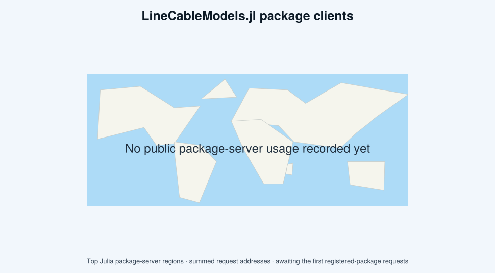

# LineCableModels.jl

[`LineCableModels.jl`](https://github.com/Electa-Git/LineCableModels.jl) is a specialized Julia package designed to compute the electrical parameters of coaxial arbitrarily-layered underground/overhead cables with uncertainty quantification. It focuses on calculating line and cable impedances and admittances in the frequency-domain, accounting for skin effect, insulation properties, and earth-return impedances with frequency-dependent soil models.

## Documentation outline

```@contents
Pages = [
    "index.md",
    "tutorials.md",
    "reference.md",
    "bib.md",
]
Depth = 1
```

## Features

- Describes deterministic and uncertain designs through one typed
  `Grid`/`Gridspace` grammar, then evaluates them through `compute!`.
- Calculates base cable parameters for solid, tubular or stranded cores,
  semiconductors, screens, armors, sheaths, tapes, and water-blocking materials.
- Correction factors to account for temperature, stranding and twisting effects on the DC resistance [app14198982](@cite), GMR [6521501](@cite) and base inductance of stranded cores and wire screens [yang2008gmr](@cite).
- Explicit computation of dielectric losses and effective resistances for insulators and semiconductors [916943](@cite). Correction of the magnetic constant of insulation layers to account for the solenoid effect introduced by twisted strands [5743045](@cite).
- Computes phase-domain Z/Y matrices for polyphase systems with any number of
  conductors per phase, with optional Measurements-based direct propagation or
  conditional Monte Carlo analysis.
- Improved equivalent tubular representation for EMT simulations and direct export to ATPDraw and PSCAD formats.
- Computes internal impedances of solid, tubular or coaxial multi-layered single-core (SC) cables, using rigorous [4113884](@cite) or equivalent approximate formulas available in [industry-standard EMT software](https://www.pscad.com/webhelp/EMTDC/Transmission_Lines/Deriving_System_Y_and_Z_Matrices.htm).
- Computes earth-return impedances and admittances of underground conductors in homogeneous soil, based on a rigorous solution of Helmholtz equation on the electric Hertzian vector, valid up to 10 MHz [5437464](@cite).

## Installation

Install the registered package from Julia's package manager:

```julia-repl
pkg> add LineCableModels
```

Then load the core package:

```julia
using LineCableModels
```

Plotting is optional. Load one backend explicitly before calling `preview` or
`plot`:

```julia
using LineCableModels
using CairoMakie
```

FEM/GetDP integration and sector-shaped cable support were removed before the
v0.2 release. The last version containing those experimental paths is preserved
on branch `legacy/fem-sector` at commit
`b75dd2723f90a83ec090b20605ea42af57f4a9c3`.

## User statistics



The map is generated in CI from Julia's public package-server request logs. It
shows the top server regions by the sum of `request_addrs` for requests marked
as user traffic. These regional aggregates are useful adoption indicators, but
they are not a count of distinct people and must not be read as country-level
telemetry.


## License

The source code is provided under the [BSD 3-Clause License](https://github.com/Electa-Git/LineCableModels.jl/LICENSE).

---
```@raw html
<p align="left">Documentation generated using <a target="_blank" href="https://github.com/JuliaDocs/Documenter.jl">Documenter.jl</a> and <a target="_blank" href="https://github.com/fredrikekre/Literate.jl">Literate.jl</a>.</p>
```
