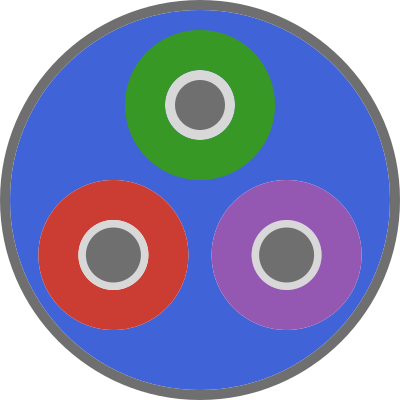

::: {.lc-template-stage .lc-cs-template-stage}

```{=html}
<div class="lc-cs-shell" data-lc-collapsible-sidebar data-sidebar-state="expanded">
  <aside class="lc-cs-sidebar" aria-label="Example application navigation">
    <header class="lc-cs-sidebar-header">
      <div class="lc-cs-identity" data-tooltip="LineCableModels playground">
        
        <span class="lc-cs-identity-copy">
          <strong>LineCableModels.jl</strong>
          <small>Engineering workspace</small>
        </span>
      </div>
      <button class="lc-cs-toggle" type="button" data-sidebar-toggle data-tooltip="Collapse navigation" aria-label="Collapse navigation" aria-expanded="true" aria-controls="lc-cs-demo-navigation">
        <svg viewBox="0 0 24 24" aria-hidden="true" focusable="false">
          <path d="m14.5 6-6 6 6 6"></path>
        </svg>
      </button>
    </header>

    <nav class="lc-cs-navigation" id="lc-cs-demo-navigation">
      <section class="lc-cs-nav-section" aria-labelledby="lc-cs-section-workspace">
        <h2 class="lc-cs-section-heading" id="lc-cs-section-workspace">Workspace</h2>

        <button class="lc-cs-nav-item" type="button" data-demo-title="System overview" data-tooltip="System overview" aria-label="System overview">
          <svg class="lc-cs-nav-icon" viewBox="0 0 24 24" aria-hidden="true" focusable="false">
            <rect x="3" y="3" width="7" height="7"></rect>
            <rect x="14" y="3" width="7" height="7"></rect>
            <rect x="3" y="14" width="7" height="7"></rect>
            <rect x="14" y="14" width="7" height="7"></rect>
          </svg>
          <span class="lc-cs-nav-label">System overview</span>
        </button>

        <button class="lc-cs-nav-item is-hover-preview" type="button" data-demo-title="Cable geometry" data-tooltip="Cable geometry · hovered state" aria-label="Cable geometry">
          <svg class="lc-cs-nav-icon" viewBox="0 0 24 24" aria-hidden="true" focusable="false">
            <circle cx="12" cy="12" r="8.5"></circle>
            <circle cx="12" cy="8.5" r="2.15"></circle>
            <circle cx="8.7" cy="14.2" r="2.15"></circle>
            <circle cx="15.3" cy="14.2" r="2.15"></circle>
          </svg>
          <span class="lc-cs-nav-label">Cable geometry</span>
        </button>

        <button class="lc-cs-nav-item is-active" type="button" data-demo-title="Line parameters" data-tooltip="Line parameters · active" aria-label="Line parameters" aria-current="page">
          <svg class="lc-cs-nav-icon" viewBox="0 0 24 24" aria-hidden="true" focusable="false">
            <path d="M4 7h10"></path>
            <path d="M18 7h2"></path>
            <circle cx="16" cy="7" r="2"></circle>
            <path d="M4 12h3"></path>
            <path d="M11 12h9"></path>
            <circle cx="9" cy="12" r="2"></circle>
            <path d="M4 17h8"></path>
            <path d="M16 17h4"></path>
            <circle cx="14" cy="17" r="2"></circle>
          </svg>
          <span class="lc-cs-nav-label">Line parameters</span>
          <span class="lc-cs-active-indicator" aria-hidden="true"></span>
        </button>
      </section>

      <section class="lc-cs-nav-section" aria-labelledby="lc-cs-section-analysis">
        <h2 class="lc-cs-section-heading" id="lc-cs-section-analysis">Analysis</h2>

        <button class="lc-cs-nav-item" type="button" data-demo-title="Frequency sweep" data-tooltip="Frequency sweep" aria-label="Frequency sweep">
          <svg class="lc-cs-nav-icon" viewBox="0 0 24 24" aria-hidden="true" focusable="false">
            <path d="M3 19h18"></path>
            <path d="M5 17V5"></path>
            <path d="m6 15 4-5 3 2 5-7"></path>
          </svg>
          <span class="lc-cs-nav-label">Frequency sweep</span>
        </button>

        <button class="lc-cs-nav-item" type="button" data-demo-title="Result archive" data-tooltip="Result archive" aria-label="Result archive">
          <svg class="lc-cs-nav-icon" viewBox="0 0 24 24" aria-hidden="true" focusable="false">
            <path d="M4 4h16v5H4z"></path>
            <path d="M5.5 9v11h13V9"></path>
            <path d="M9 13h6"></path>
          </svg>
          <span class="lc-cs-nav-label">Result archive</span>
        </button>

        <button class="lc-cs-nav-item" type="button" data-tooltip="Remote execution unavailable" aria-label="Remote execution unavailable" disabled aria-disabled="true">
          <svg class="lc-cs-nav-icon" viewBox="0 0 24 24" aria-hidden="true" focusable="false">
            <rect x="3" y="4" width="18" height="16" rx="1"></rect>
            <path d="m7 9 3 3-3 3"></path>
            <path d="M13 15h4"></path>
          </svg>
          <span class="lc-cs-nav-label">Remote execution</span>
          <span class="lc-cs-disabled-label">Unavailable</span>
        </button>
      </section>
    </nav>

    <footer class="lc-cs-sidebar-footer" data-tooltip="Local template · no services connected">
      <span class="lc-cs-status-mark" aria-hidden="true"></span>
      <span class="lc-cs-footer-copy">
        <strong>Local template</strong>
        <small>No services connected</small>
      </span>
    </footer>
  </aside>

  <div class="lc-cs-workspace" role="main">
    <header class="lc-cs-workspace-bar">
      <div>
        <span class="lc-cs-context">Workspace&nbsp; › &nbsp;Demonstration</span>
        <strong data-demo-page-title>Line parameters</strong>
      </div>
      <span class="lc-cs-mode" data-sidebar-state-label>Expanded navigation · 18rem reserved</span>
    </header>

    <div class="lc-cs-canvas" role="region" aria-label="Example content canvas">
      <div class="lc-cs-canvas-copy">
        <span class="lc-cs-kicker">TEMPLATE PRIMITIVE</span>
        <h2>Persistent engineering canvas</h2>
        <p>The navigation shell changes only its own presentation. Collapse it to verify that this working area immediately reclaims the released width.</p>
      </div>

      <div class="lc-cs-analysis-layout">
        <figure class="lc-cs-figure">
          <figcaption>
            <strong>Two-conductor line arrangement</strong>
            <span>local mock geometry</span>
          </figcaption>
          <svg viewBox="0 0 780 300" role="img" aria-label="Mock cross-section of two underground cables">
            <path class="lc-cs-ground" d="M40 72H740"></path>
            <path class="lc-cs-depth-line" d="M240 72V205M540 72V205"></path>
            <path class="lc-cs-dimension" d="M240 108H540"></path>
            <path class="lc-cs-dimension-cap" d="M240 100V116M540 100V116"></path>
            <text class="lc-cs-svg-label" x="390" y="98" text-anchor="middle">6.0 m lateral spacing</text>
            <text class="lc-cs-svg-label" x="228" y="151" text-anchor="end">1.0 m</text>
            <circle class="lc-cs-cable-outer" cx="240" cy="205" r="50"></circle>
            <circle class="lc-cs-cable-inner" cx="240" cy="205" r="23"></circle>
            <circle class="lc-cs-cable-core" cx="240" cy="205" r="13"></circle>
            <circle class="lc-cs-cable-outer" cx="540" cy="205" r="50"></circle>
            <circle class="lc-cs-cable-inner" cx="540" cy="205" r="23"></circle>
            <circle class="lc-cs-cable-core" cx="540" cy="205" r="13"></circle>
            <text class="lc-cs-svg-node" x="240" y="278" text-anchor="middle">CABLE 01</text>
            <text class="lc-cs-svg-node" x="540" y="278" text-anchor="middle">CABLE 02</text>
          </svg>
        </figure>

        <aside class="lc-cs-state-panel" aria-label="Demonstrated states">
          <span class="lc-cs-kicker">STATE COVERAGE</span>
          <h3>Interaction specimen</h3>
          <dl>
            <div><dt>Normal</dt><dd>System overview</dd></div>
            <div><dt>Hovered</dt><dd>Cable geometry</dd></div>
            <div><dt>Active</dt><dd>Line parameters</dd></div>
            <div><dt>Disabled</dt><dd>Remote execution</dd></div>
          </dl>
          <p>In rail mode, hover or focus any retained icon to inspect its tooltip.</p>
        </aside>
      </div>
    </div>
  </div>
</div>
```

:::

```{=html}
<script src="components/collapsible-sidebar.js"></script>
```
