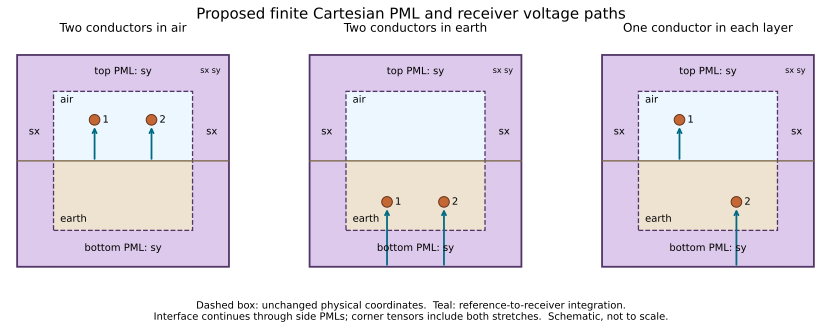

> Historical investigation record. Equations, observations and limitations are
> retained at their recorded source versions. Referenced prototypes and campaign
> launchers may have been retired; their commands and pending-work statements
> are not current execution instructions. See the [cleanup record](fem_development_cleanup.md)
> and [current PML controls](fem_fixed_pml_controls.md).

# PML design and acceptance specification for the Gmsh/GetDP backend

Prepared 2026-09-25; implementation is now in progress on the dedicated FEM investigation branch. This specification records the acceptance campaign, not a claim that it has passed. See `fem_pml_execution.md` for measured results and deviations justified by testing.

## 1. Decision and evidence

Replace the real infinite-element exterior, for these time-harmonic formulations, with a **finite, graded, Cartesian coordinate-stretch PML** around the physical air/earth domain. Use ordinary GetDP volume Jacobians and transform the material tensors and the complete weak forms. Keep the existing air-side outer `v=0` condition at the *outside of the PML*. No electric boundary condition is imposed on the physical air/earth interface.

The established defect is an inadequately resolved outgoing exterior, especially in air. The previous investigation localized the 100 Ω·m, 1 MHz quasi-fw sensitivity to AirInf: changing quadrature only there moves G11 from −0.129370 to −0.163416 µS/m; changing it only in EarthInf gives −0.128895 µS/m. The analytical value is −0.288927 µS/m. A refined outgoing radial prototype gives −0.288312 µS/m, but the coarse prototype worsens the 166.8 kHz result. Therefore the prototype establishes a useful mechanism, not a broadband default.

Full evidence, reproduction scripts, accepted data, and the excluded stale-path refinement are documented in the local preceding diagnosis at `/tmp/fem-rho100-diagnosis/README.md`. The retained original quasi-fw input is `.linecablemodels/fem/runs/run-scf77b`; the later `run-R5y0jy` uses quasi-tem. Do not mix these branches when reproducing the screenshots. Both runs already have the requested outer scalar Dirichlet condition.

The original real map compresses infinitely many air wavelengths into a finite shell. Increasing its quadrature or physical radius can move the error without establishing an outgoing solution. The official [GetDP full-wave tutorial](https://getdp.info/dev/doc/texinfo/getdp.html#Tutorial-5_003a-Full_002dwave-model-of-a-rectangular-waveguide) uses an absorbing exterior condition for its wave problem rather than its static infinite ring. The proposed PML addresses that exterior limitation; it does not change the established earth material law or presume a defect in the successful buried formulation.

## 2. What the local examples and papers actually provide

All paths below are relative to `/home/amartins/Documents/KUL/`.

| Source examined | Useful content | Limit on reuse |
|---|---|---|
| `MultiLayerZY/fem/templates/models-getdp/ElectromagneticWaveguides/guide_rib..pro`, roughly lines 134–184 | Cartesian stretch, diagonal tensors, separate substrate/superstrate PML regions | Eigenmode example; its dimensional scaling, geometry and controls are not cable defaults |
| `MultiLayerZY/fem/templates/models-getdp/ECE_full_wave_E-H_monopole/monopole2Daxi.pro`, PML functions | Radial/Cartesian stretch in an ECE Maxwell model | Air exterior; sigma in its PML is not transformed like epsilon. With sigmaAir=0 this does not validate a conducting-earth PML |
| `MultiLayerZY/fem/templates/models-getdp/Antennas/dipole.pro` and `Microwave.pro` | Positive-time stretch sign; epsilon tensor and inverse-mu tensor; field and A/phi formulations | Singular logarithmic profile and antenna geometry are examples, not a discretization prescription for this problem |
| `MultiLayerZY/fem/templates/models-getdp/AcademicWaves/formulations_scalarWaves.pro`, lines 97–101 | Different transformed scalar gradient and mass coefficients | Supports the scalar derivation below; do not substitute the electromagnetic tensors into a squared scalar coefficient |
| `linecablemodels-fem/lib/jacobian_integration.pro` and `MultiLayerZY/fem/lib/` | Existing real `VolSphShell` usage | No PML definition was found in these two active library trees; this does not establish that no other historical implementation has one |
| `MultiLayerZY/bibliography/WavePropagationThinWire-Unified.pdf`, §§6–9 | Current closure, vertical voltage, surface/deep references, mixed directions and limits of matrix symmetry | Preserve these measurement definitions when comparing to the analytical evaluator |
| `MultiLayerZY/bibliography/Validation_Limits_of_Quasi-TEM_Approximation_for_Buried_Bare_and_Insulated_Cables.pdf` (Magalhães et al., 2015) | Explicit propagation assumptions and broadband buried comparisons | A quasi-TEM approximation need not mean deleting temporal displacement current; this paper does not validate the backend's scalar electric PDE |
| D'Amore and Sarto, 1996, Parts I/II, PDFs in the same bibliography | Wideband single- and multiconductor line models with explicit approximations | Physics/model references, not PML implementations or replacements for matching the voltage/current variables |
| `Finite_Element_Method_Analysis_of_a_Three-Media_Submarine_Cable_Ground_Return_Impedance_at_Varying_Depth.pdf` | Asymptotic boundary and skin-depth mesh study | This FEM comparison neglects displacement current. Its successful air treatment is not evidence of wave absorption for the present operator |

Additional primary references:

* [Johnson, Notes on Perfectly Matched Layers](https://arxiv.org/pdf/2108.05348): coordinate continuation, smooth turn-on, discretization error, evanescent and grazing components. A PML can match the continuum equations while reflecting after discretization. Imaginary stretching does not increase attenuation of a purely evanescent component; physical clearance and thickness still matter.
* [Oskooi and Johnson, JCP 230 (2011), 2369–2377](https://math.mit.edu/~stevenj/papers/OskooiJo11.pdf): tensor transformation and the test of comparing different PML thicknesses while refining the mesh. A small reflection at one resolution is insufficient.
* [Official DOLFINx electromagnetic wire/PML example](https://docs.fenicsproject.org/dolfinx/main/python/demos/demo_pml.html): finite-element implementation transforming both epsilon and mu and checking an analytical solution. Its phasor sign must be converted to this code's convention before reuse.

## 3. Geometry: why Cartesian here

Use a physical rectangle containing every conductor, coating and physical voltage-reference point. Surround it with left/right, top/bottom and corner PML regions. The horizontal air/earth interface continues through the side PMLs to the outer boundary. Corners have both stretches; they are not omitted or assigned a one-direction tensor.

With horizontal coordinate x, vertical coordinate y and axial coordinate z, the starting physical box is

    x_c − L < x < x_c + L,   −L < y < L,
    L = max(existing layout clearance, domain_skin_depths × δ_earth).

For the first comparison retain `domain_skin_depths=2`. This is a starting distance from the sources, not an absorbing-boundary guarantee. Material-dependent decay/phase lengths, coatings and every conductor's skin depth still determine element sizes. Use the actual evaluated material properties at each frequency. Where the good-conductor skin-depth approximation ceases to apply, report the exact `1/Re(q_earth)` as well as δ.

Cartesian stretching is chosen for two specific reasons:

1. A shared x stretch leaves the stratification unchanged: material properties depend on y, not x. Top and bottom stretches start in their respective homogeneous half-spaces. This also gives a clear route to horizontal multilayers without stretching an interface through another material.
2. Every vertical receiver path lies in the central x strip, where x is unchanged. Its buried extension enters only the bottom PML, so its continuation is a one-variable contour deformation at fixed real x.

Radial PML is possible for a two-half-space interface through its center; it is not rejected as intrinsically invalid. However, the earlier radial prototype does not establish how its complex continuation preserves each off-axis, vertical buried voltage path. The Cartesian choice removes that uncertainty from the main implementation.

Implementation update: the initial nested rectangular-ring mesh failed the
strong-side-stretch corner control (about 18% corner-field error persisted from
64 to 256 normal layers). The mesh now uses ten Cartesian patches whose edges
coincide with `x=x_c±L`, `y=±L` and `y=0`. Each corner resolves both stretched
coordinates. Normal curves use a geometric progression with final/first cell
ratio `8N`; refinement therefore also resolves the steep entrance profile.
This correction is being checked with the same independent cylindrical fields.

Physical tags distinguish physical air, physical earth, air PML, earth PML and the outer boundary. The PML is not a third physical material or additional physical conductivity. No conductor or dielectric coating may extend into it. Retain a continuous, conforming interface mesh, including where y=0 meets the side PML.

## 4. Coordinate map, phasor sign and profile

All equations use `exp(+jωt)`. Define physical material admittivity

    κ_m = σ_m + jω ε_m,     q_m² = jω μ_m κ_m.

Use the outgoing/decaying branch `Re(q_m) ≥ 0, Im(q_m) ≥ 0` for the passive scalar media in this study. In air `q_air = j k0`. The native PDE uses κ directly; these roots size/verify the exterior, not select signs of computed G.

For outward distance d into a PML of computational thickness t, use

    ξ = d/t,                     0 ≤ ξ ≤ 1,
    s(d) = 1 + (1 − j) b ξ³,
    F(d) = d + (1 − j) b t ξ⁴/4,       F'(d) = s(d).

The global transformed coordinate is `x_b + F(d)` on the right and `x_b − F(d)` on the left; likewise at top/bottom. In both orientations the derivative with respect to the corresponding global coordinate is s. Inside the physical box all stretches equal 1. The cubic profile starts with zero absorption and zero first derivative; there is no singular pole at the outer boundary.

Let `S=diag(sx,sy,1)`, mapping real mesh coordinates into complex coordinates, and `D=det(S)=sx sy`. Then

    T = D S⁻¹ S⁻ᵀ = diag(sy/sx, sx/sy, sx sy),
    κ̃ = κ T,   ε̃ = ε T,   σ̃ = σ T,   μ̃ = μ T,
    ν̃ = μ̃⁻¹ = ν T⁻¹.

These are algebraic transposes, not Hermitian transposes. In particular, preserve the complex-valued tensor factors; do not take magnitudes or real parts before assembly. The finite-element test-space conjugation convention is separate from this coordinate transformation.

Transform conductivity as well as epsilon and mu in earth. Transforming only epsilon would leave the dominant conductive part of the earth operator unmatched. Avoid splitting complex transformed sigma into the `Complex[sigma,omega*epsilon]` constructor intended for real scalar inputs: form κ̃ by complex multiplication, or keep the separate transformed weak terms consistently.

The same `sx(x)` must be used above and below y=0. Choosing a different side stretch by host medium creates incompatible transformed tangential coordinates. Top and bottom `sy` may use different profiles because their onsets lie away from the interface. At corners use the product of the corresponding x and y stretches.

### Starting numerical parameters, subject to the acceptance campaign

Use cubic degree 3 and initial `t_left=t_right=t_top=t_bottom=L`. Choose a nominal **normal-incidence round-trip amplitude** target `R0=10⁻¹⁰`; let `η=−log(R0)/2`. Define

    b_side = 4η/(k0 t_side),    b_top = 4η/(k0 t_top),
    b_bottom = 4η/(Im(q_earth) t_bottom).

The bottom prescription conservatively ignores the earth's existing real attenuation. For an outward wave `exp(−qF)`, the attenuation exponent across the layer is

    A = Re(q)t + Im(q)b t/4 ≥ 0.

Thus these signs attenuate outgoing waves. The above R0 is an ideal normal-wave design input, **not an error bound on Y**, an oblique mode, an evanescent mode, or the discrete solution. R0 must not be tuned to match a particular analytical conductance.

The default candidates apply only to positive frequencies. At the low end of 0.1 Hz–1 MHz, `b_side` can be millions; this is a known stiffness and mesh-resolution concern, not a reason to add a frequency floor or silently disable displacement current. The low-frequency checks below are mandatory. If the specified coordinate grading and scaling cannot meet them, these candidates have failed: investigate a better real-coordinate grading or a rigorously revalidated complex-frequency-shift profile on the implementation branch. Neither CPML time-history machinery nor a new formulation switch is needed for this frequency-domain correction.

The initial purely imaginary profile failed the evanescent-mode controls: at
`k_air L=0.21`, 256 layers, the lossless layered TE case had about 14% normalized
error against its own finite-PML solution. Adding the equal positive real part
reduced that error to about 0.003%, while retaining the normal propagating-wave
attenuation. This correction stretches real distance as well as absorbing waves;
it does not add physical conductivity. Grazing-incidence finite-boundary error
still requires separate assessment. Low-frequency mixed-potential solves also
require PETSc diagonal equilibration, with restoration before residual evaluation.

## 5. Apply the map to every weak-form block

Use ordinary `Jacobian Vol` for the PML geometry. Do not retain `VolSphShell` on it: applying both transformations would double-count the geometry. Identity tensors in the physical region leave its weak form unchanged.

Use `Tt=diag(sy/sx,sx/sy)`, `κt=κ Tt`, `κz=κ D`, `νt=ν Tt⁻¹`, `νz=ν/D`. The z coordinate is not stretched.

For quasi-fw, keep the current normalization `Az=a`, `At=Γ b`, `phi=Γ v` in the Γ→0 reduction. The following is a term audit, with signs and terminal drives otherwise preserved from the existing formulation:

| Existing term/block | Required coefficient or operation |
|---|---|
| Axial magnetic `curl(a ez)`–`curl(test_a ez)` | νt, not νz |
| Axial `jωκ a` mass and axial current terms | κz |
| Transverse `curl(b)`–`curl(test_b)` | νz |
| Transverse `jωκ b` mass | κt |
| `κ grad(v)` in the b equation | κt |
| Axial/transverse magnetic coupling | `−ez × (νt curl(a ez))` |
| Scalar continuity gradient term | κt |
| Scalar continuity term involving `jω b` | κt |
| Scalar continuity source involving axial a | κz |

For finite-metal a/u, retain its current constraints and conductor constitutive model. Metal regions lie wholly inside the identity map, so imposed physical currents and terminal global terms are unchanged. The outer-media a/u contributions must still use the correct transformed coefficients. Retain the existing tree gauge and terminal transverse trace conditions, and test the gauge-invariant voltage after transformation.

For quasi-tem, transform the axial a/u block in the same manner. Its electric block is the existing scalar equation

    −div(κ grad(v)) + jω μ κ² v = source.

The pulled-back electric weak terms are **κ Tt** for the gradient and **jω μ κ² D** for the scalar mass. Here μ and κ in the mass are the original physical scalars. Squaring a transformed κ tensor and multiplying a transformed μ is incorrect for this PDE. Its transverse-current terminal constraint and scalar voltage difference remain the existing definitions.

This preserves the distinction between the two public physics choices. The PML supplies each one's exterior; it does not make the scalar equation mathematically identical to the coupled Maxwell voltage model.

At the outside of the finite PML keep `a=0`, `v=0`, and the existing zero tangential b trace where b exists. These truncate an attenuated field. Test independence from moving that wall. The physical air/earth interface remains a material interface, with continuity supplied by the conforming weak formulation; it is neither grounded nor insulated by this change.

## 6. Voltage extraction, including mixed layouts

Preserve terminal ordering and source-current normalization. Native `P` is voltage per imposed transverse current, in Ω·m; `Y=inv(P)`. The analytical potential-coefficient convention uses `Pe=jω P`. This factor belongs in comparisons, not in an extra native inversion factor.

The current public analytical evaluator and the FEM both choose the reference by receiving layer:

* An air receiver measures to the surface directly below each receiver sample.
* An earth receiver measures to infinite depth in earth.

For quasi-fw the functional is

    V_i/Γ = v_i − v_ref + jω ∫reference→receiver b · dl.

Air paths remain entirely inside the identity region. Preserve existing perimeter averaging for bare overhead disks and the current endpoint conventions for other terminals. Do not silently change buried receivers from their existing contour endpoint to circumferential averages as part of a boundary fix; quantify this distinction when comparing a finite electrode to the manuscript's averaged model.

For a buried receiver, keep x fixed and run the mesh path vertically from the bottom wall to the receiver. Below every source and interface, write outward depth as `d` and complex depth as `F(d)`. Each passive-earth outgoing spectral component has `exp(−a_earth F(d))`, with its decaying branch. In the source-free homogeneous lower half-space the gauge-invariant vertical field can be continued along this contour: its singularities stay outside the deformation, and its tail decays in the chosen quadrant. This justifies deforming the **same vertical-depth integral**, not substituting an arbitrary path in the physical two-dimensional plane.

The computational edge field is already the pulled-back one-form:

    b_hat = Sᵀ b(F),     b_hat · dl_mesh = b(F) · dl_complex.

Integrate b_hat using the mesh-coordinate line weights. Do not multiply by sy again and do not replace it by the apparent physical vector b(F) with unchanged weights. Retain the scalar endpoint difference. At finite PML thickness the omitted tail and the hard-wall error remain numerical errors; test them by increasing bottom thickness and checking an independent physical-depth integral.

The verification is of the gauge-invariant combination `grad(v)+jω b`; decay of an arbitrary gauge potential alone is not a sufficient test. Required controls:

1. Known decaying half-space spectral modes: numerical pulled-back voltage against the analytic complex-contour integral.
2. At a real depth below all conductors, split the voltage into the physical path above that depth and the lower continuation. Compare against the same real-depth spectral tail evaluated independently.
3. Increase bottom thickness/attenuation and refine its mesh; the complete voltage must converge without changing the reference.
4. Regenerate every receiver/path file after a mesh or geometry change. Stale paths already produced a misleading refinement in the preceding investigation.

For mixed layouts, assemble and compare both ordered mutual entries. The analytical reference must apply the air-row surface shift and earth-row deep reference **before** the matrix inversion/current closure. The manuscript's common-deep-reference mixed formulas cannot be compared directly to a matrix with host-dependent row references. Do not symmetrize `P` or `Y`, enforce positive G, or use reciprocity of physical media as proof that these particular path-defined matrices must be symmetric. An exchange of identical conductors in a symmetric same-layer geometry is a separate symmetry check that should hold.

## 7. Mesh, quadrature, scaling and field maps

The mesh must resolve the transformed equations, not merely the drawn PML thickness. Use layers conforming to the PML interfaces and corners. Start with **128 layers per stretched direction**, and split conforming cells into triangles. The original design proposed quadratic node positions; the implementation uses Gmsh's native geometric progression with last/first cell ratio `8N`, as recorded in section 3. Refine 64/128/256 in the primitive benchmarks and use additional refinement where the study requires it. N=128 is a calibration candidate, not a universal accuracy claim. The physical-domain mesh can remain unstructured.

Track `q_m ΔF`, stretch variation, aspect ratios, and the physical/PML interface mesh. A common side profile sized for air can produce much shorter effective scales in earth, especially at low frequency. Do not assume that natural earth attenuation makes the first earth-PML elements irrelevant. Preserve conductor boundary and skin-depth resolution independently of exterior-layer refinement. Broad mesh-size growth must not change the conductor polygons unnoticed during an exterior-only comparison.

Initial PML volume integration uses the supported 12-point triangle rule. Verify it against the next supported higher rule, independently of mesh refinement, since the profile creates rational coefficients. Use the same appropriate quadrature for coupled terms so that changing one block does not manufacture an inconsistency. Record actual supported rules from the installed GetDP version rather than assuming arbitrary triangle orders exist.

Change one control at a time when studying convergence:

* physical box position L, holding prescribed element sizes and PML thickness/profile fixed;
* PML thickness t, retaining core mesh, layer-size targets and total normal attenuation η;
* total attenuation η/2, η, 2η, holding thickness and mesh fixed;
* PML mesh density, holding map and physical mesh fixed;
* physical/conductor mesh density, regenerating paths;
* quadrature order, on identical mesh/map.

On a thickness change b is recomputed from the formula above to retain η; on an attenuation change b changes. These are distinct experiments. Do not let the old `shell_h=2 domain_h` rule select PML resolution implicitly.

Use existing direct-solver scaling/pivoting facilities where available and retain residuals. A small residual is not a discretization bound. Diagnose low-frequency cancellation and conditioning separately from a failed PML. Do not silently introduce acceptance/retry/fallback policies in the production solver.

Field-map output is part of validation. For each selected source column export physical-region a, v, normalized b, `Et/Γ=−grad(v)−jωb`, `Jt/Γ`, axial current and material/region IDs, plus PML computational-field magnitude/phase. Label the normalized transverse quantities accurately; the Γ→0 model does not produce a nonzero unnormalized transverse field by choosing an arbitrary Γ. PML fields are transformed quantities and must not be plotted as ordinary physical fields without the appropriate pullback inversion. Give the physical close-up and exterior views separate scales, show the interface/PML onset, and include line cuts through each layer. Avoid averaging material-dependent current across the interface.

## 8. Required spectrum and geometry matrix

Use finite copper wires, T=20 °C, radius 0.0425 m, spacing 1 m, air as currently modeled, earth epsilon_r=mu_r=1, and the same constitutive selections as the retained reproduction. Resolve the existing material model rather than inventing a new copper constant. Both basis currents must be solved in every two-conductor case.

| Layout | Conductor 1 (x,y), m | Conductor 2 (x,y), m | Required models | Required earth resistivity |
|---|---|---|---|---|
| Two in air | (0,+1) | (1,+1) | quasi_tem, quasi_fw | 1, 100, 1000 Ω·m |
| Two in earth | (0,−1) | (1,−1) | quasi_tem, quasi_fw | 1, 100, 1000 Ω·m |
| One in each | (0,+1) | (1,−1) | quasi_tem, quasi_fw | 1, 100, 1000 Ω·m |

The current study spectrum is **0.1 Hz to 1 MHz**. Use the union of:

* 71 logarithmic points, ten intervals per decade;
* all ten historical runner points `10^range(−1,6,length=10)`, including 4641.5888, 27825.5940 and 166810.0537 Hz;
* 31 logarithmic points from 100 kHz to 1 MHz, to expose high-frequency jumps rather than connect a few endpoints.

After deduplication this is **99 frequencies × 18 combinations = 1,782 case/frequency points**, with **3,564 source columns per complete sweep**. The complete numerical grid is supplied in `frequencies.csv` and `cases.csv`; these files are a test manifest, not completed results.

Add the original 0.1 Ω·m air case as a preservation control, and repeat the actual retained successful buried fixtures with their original geometries/materials. Additional targeted checks use the user's original 0.001, 0.01 and 0.085 m radius sweep, an asymmetric pair, and a soil-permittivity variant; these supplement rather than replace the mandatory matrix. Reordering a mixed pair must permute source and receiver indices correctly, while retaining the receiver's host reference.

### Verification sequence on the implementation branch

1. **Coordinate and operator benchmarks:** GetDP scalar Helmholtz outgoing cylindrical/plane-wave examples; vector Maxwell TE/TM plane waves at 0°, 45°, 80° and 89°; evanescent modes; lossless and conductive media; two-layer Fresnel reflection/transmission with the interface passing through the side PML. Use correct phasor branches. Include corners, tensor/coupling audits and the bottom-voltage contour checks. A Cartesian PML around a layered interface is not validated by a homogeneous-air example alone.
2. **PML convergence:** in those benchmarks compare t and 2t at 64,128,256 layers, with a controlled core mesh. Differences must decrease toward the finite-tail/reference error budget as resolution increases; a low error at just one thickness is insufficient. This applies the validation principle in Oskooi–Johnson without claiming zero finite-thickness error.
3. **Full baseline sweep:** all 1,782 points for each formulation/layout/material combination, raw matrices retained.
4. **Full spectrum refinement:** repeat the same grid with physical and PML mesh refinements separated. At minimum, retain a full-grid PML-refined sweep, a physical-mesh-refined sweep, and a doubled-thickness sweep; no default is accepted on a one-frequency match. The test program must make these variants explicit, reuse a factorization across the two source columns, and keep a manifest of missing/failed cases.
5. **Independent control sweeps:** domain L at factors 1,1.5,2; η at factors 0.5,1,2; supported quadrature pair. Initially run at decade endpoints plus the historical high-frequency points for every layout, rho and formulation; expand to all neighboring/full-grid frequencies wherever the budget is exceeded or a discontinuity appears. A failed combination remains failed, rather than being replaced by a better-looking profile.
6. **Buried and mixed preservation:** compare the accepted legacy buried fixtures and test the two mixed directions and bottom-voltage continuation explicitly. Diagnose any discrepancy by comparing a, the scalar contribution, vector path contribution, P and finally Y, in that order.

Keep the full campaign manual/offline under `test/manual/`. Add only small deterministic operator/geometry/path tests and a bounded native smoke set to ordinary CI. Respect the repository's existing manual-test exclusion. Do not put thousands of native solves into the default test suite.

## 9. Reference hierarchy and acceptance reporting

There are two separate questions: does the discrete PML converge to the intended PDE, and does that PDE give the analytical line quantity being compared?

* For quasi-fw use the matching Γ=0 unified reference with total-current closure, finite-radius conventions, host-dependent voltage rows and units documented explicitly. The independent spectral evaluator in the previous investigation cross-checks the analytical implementation; it is not independent validation of the manuscript or an exact finite-electrode solution.
* For quasi-tem use an independent reference for its **scalar electric PDE** and a/u block: manufactured solutions and a converged half-space spectral/boundary solution with matching electrode/receiver conditions. Its scalar interface denominator differs from the Maxwell vertical-voltage denominator. Continue plotting its differences from unified, but classify a converged model discrepancy separately. A thin-wire scalar probe alone is not an exact finite-conductor acceptance oracle.
* Retain successful buried numerical comparisons. Where the finite electrode and circumferentially averaged line model differ, quantify the receiver/source approximation or use a matched finite-electrode reference; do not change the analytical formula or tolerance to conceal it.

The existing manual voltage study uses `atol=1e−12 S/m, rtol=0.01`, separately for signed G and B. Keep reporting that existing criterion; do not silently reinterpret it. However, it cannot establish relative accuracy of conductances far below 1e−12 S/m. Passing it does not mean that a 1e−25 S/m curve has been resolved.

For the new campaign also report, entry by entry:

* signed G=Re(Y), B=Im(Y), real/imaginary P, real/imaginary Z, units and reference;
* absolute and relative differences to the matching reference, separately for G and B;
* changes from mesh, thickness, domain, attenuation and quadrature, with their actual parameter values;
* condition estimates of extracted P, algebraic residuals, and an empirical numerical-resolution assessment; none is a rigorous error bound by itself;
* scalar/vector voltage contributions, so cancellation is visible;
* matrix permutation and geometric-symmetry checks where applicable, without imposing mixed-entry symmetry.

Proposed stricter diagnostic gate: for a resolved G entry, no individual numerical-control change should exceed 0.25% of |G_ref|, leaving headroom inside the existing 1% comparison target. Label this as a proposed additional diagnostic budget, not an already approved change to the project's accuracy policy. Use the existing absolute criterion for compatibility reporting, but label values whose sign/magnitude are not stable under refinement as **unresolved**, preserving the raw value. Do not count them as demonstrated relative conductance agreement. No blanket fixed plot floor, sign replacement, or matrix-norm-only pass is acceptable. At exact/near zeros show signed absolute error and the convergence evidence instead of dividing by zero.

Plots must show all four entries over frequency for each required layout/model, with analytical overlays and numerical variants. Include signed logarithmic plots with an explicit, visible linear threshold, linear-scale zooms, and signed absolute-error plots. Use the public plotting clip-tolerance API with clipping disabled; verify plotted y data against CSV values and verify the log toggle changes the actual axis transform. A large linear-axis dynamic range will flatten tiny nonzero values visually even if they are not clipped. Preserve numeric hover/readout or table access. No diagnostic should depend on parsing a custom JSON summary to obtain the raw conductance.

Request native maps for both source columns, both models and all three layouts at representative low/mid frequencies, 166810.0537 Hz and 1 MHz, across the three resistivities. Also retain maps at every anomalous point and its neighbors. These are planned map requests; the Cartesian PML cable fields have not yet been computed.

## 10. Code ownership and delivery boundary

Implement locally in the established FEM owners, without changing analytical kernels or introducing a general boundary-condition framework:

| Owner | Required change |
|---|---|
| `model.jl`, existing FEM computation-option validation | Resolve physical-box extents, independent PML thickness/profile and mesh targets per frequency; keep controls in execution options rather than scientific material/formula inputs |
| `geometry.jl` | Physical rectangle, side/top/bottom/corner PML partitions, continued material interface and correct tags |
| `mesh.jl` | Conforming graded PML mesh, independent core resolution, region/material checks and saved mesh metadata |
| `getdp/materials.pro` plus one small owner-local PML source if useful | Single coordinate-map/tensor definition; physical material values retained distinctly |
| `getdp/quasi-full.pro`, `getdp/quasi-tem.pro`, `jacobian.pro` | Complete term transformations above and ordinary PML volume Jacobian |
| `voltage_paths.jl` | Straight bottom computational paths and exact pulled-back edge integration; regenerate on mesh change |
| `getdp.jl`, worker source/option capture | Capture every PML asset/parameter in run snapshots and resume fingerprints; never resume a real-shell result as a PML result |
| Field postprocessing and manual studies | Correct transformed-field labels, CSV/raw results, interactive public-API plots, validation manifests |

Use the existing option mechanism and concrete mesh-plan fields; thickness, attenuation target and resolution are independently reproducible execution controls. The names of existing radius/shell fields must not quietly claim the new rectangle is the old radial infinite map. Document any field/option migration on the implementation branch; no compatibility machinery is warranted solely for this private diagnostic prototype. Preserve one source inventory through `_getdp_assets` if a sibling `pml.pro` is introduced.

No production default is selected by choosing the alpha that best matches 100 Ω·m at 1 MHz. Completion requires the required spectrum/geometry matrix, finite-PML convergence, preserved buried behavior and a verified mixed voltage functional. Unresolved low-frequency G values and scalar-model discrepancies must remain explicit in the final report.

## 11. Checks actually performed for this design

Only bounded analytical/discretization checks were run in this directory:

    python3 /tmp/fem-pml-design/check_profile.py
    python3 /tmp/fem-pml-design/check_tensors_paths.py

`check_profile.py` solves a one-dimensional P1 finite-element problem with the cubic profile and compares it to its exact finite-PML solution. It covers four air wavelength/domain ratios, air and earth operators, uniform/graded layers and 32/64/128/256 elements: 64 cases. The normal-wave round-trip target holds analytically, but discretization can dominate. At `k_air L=6.6712819e−6`, `q_earth L=2+2j`, the shared side profile gives maximum physical-region field errors of 6.278% with 32 uniform elements, 0.4433% with 32 graded elements, and 0.005288% with 256 graded elements. These are normalized field errors in this benchmark, not errors in cable G.

`check_tensors_paths.py` checks the Maxwell curl equations after the tensor/field pullback for both polarizations through representative directions, materials, frequencies and stretches. Maximum relative residual: 5.55e−16. It also verifies the pulled-back bottom-contour integral of decaying modes against the analytic antiderivative, to 9.46e−16 relative; deliberately omitting the one-form factor fails the nonzero-stretch controls.

These checks support the tensor signs, the contour operation and the need for grading. They do **not** validate GetDP assembly, two-dimensional interface/corner discretization, any production solver conditioning, or the required 1,782-point cable matrix. That execution remains work for the implementation branch.
